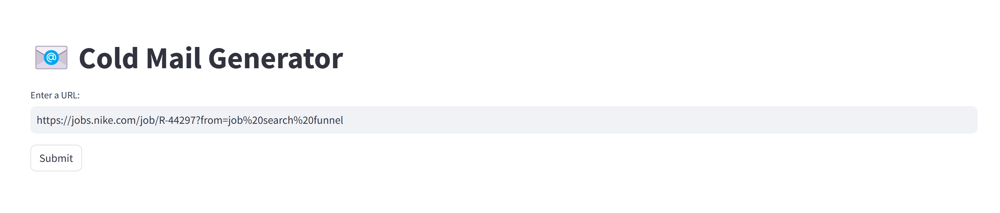

# Cold Mail Generator

Generate a cold email based on a job posting to a client company with relevant portfolio links for the completed projects from your company. (Default company name: ABC Inc)

## Table of Contents

- [About](#about)
- [Features](#features)
- [System Architecture](#system_architecture)
- [Usage](#installation)


## About

This project solves a simple business problem where we need generate cold mails from a job posting. This helps a company to offer certain services to a client company based on their job posting. This is customizable to generate various email templates by using relevant prompts.


## Features

- Offers a simple steamlit app for a protype testing
- This uses LLAMA 3.1 to generate cold emails
- This will save a lot of time writing emails based on different job requirement and generate a base email by extracting the key informations from a job posting which we can modify if needed.

## System Architecture
   

## Usage

### Prerequisites

Make sure you have the following installed on your system:
1. To get started we first need to get an API_KEY from here: https://console.groq.com/keys. Inside `app/.env` update the value of `GROQ_API_KEY` with the API_KEY you created.

2. To get started, first install the dependencies using:
    ```commandline
     pip install -r requirements.txt

### Step-by-Step Guide

1. Clone the repository:

   ```bash
   git clone https://github.com/Api1998/cold_email_generator.git
   ```

2. Run the streamlit app:
   ```commandline
   streamlit run app/main.py
   ```
3. Input a valid URL for a job posting to generate your cold emil



Credits:- Codebasics